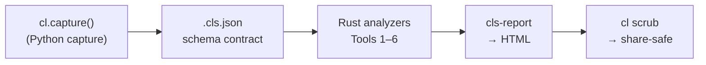

# compile-lens

> **A diagnostic suite for `torch.compile` production observability (Python + Rust)** — it turns PyTorch's own tracing evidence into workflow-ready answers for recompile / regression / divergence / lint / kernel / fusion triage, and exports everything a reviewer or on-call needs as one shareable HTML report.

[](./LICENSE)
[](#roadmap)

<!-- hero-shot-placeholder: a screenshot of examples/hero.html lands here — open that committed
     report in a browser and screenshot the top. -->

A worked **hero report** lives at [`examples/hero.html`](./examples/hero.html) — **one `cl.capture()`
call** over a single `torch.compile` workload, rendered to one self-contained offline HTML. **Open it
directly; no build, no install.** The model has several real problems at once, the way a messy PR
does, and the report surfaces each in its own section: a **recompile storm** attributed to a changing
batch axis (Tool 1), a silent **sign-flip regression** recovered as exactly one `modified` node
against its baseline (Tool 2a), an **eager-vs-compiled divergence** localized to the first layer that
disagrees (Tool 3), an **in-place-on-alias** correctness risk from a static scan (Tool 4), and three
**`Pattern A` fusion** opportunities Inductor left on the table (Tool 6) — plus an honest "cache
stable" check and a roofline section that states it needs a GPU capture. One capture; the cross-tool
triage that would have cost an afternoon of `TORCH_LOGS` scrolling and manual diffing, on one page —
and every finding points at the exact source line to change (the diff names *what* changed and where,
fusion shows the chain and what to fold, recompile locates the compiled region).
Regenerate it with `./scripts/render_hero.sh`.

---

## What's in the box

`cl.capture()` drives every collector over one `torch.compile` workload in a single call; the analyzers read what it captured and one surface renders them into a self-contained HTML report. (`cl.session()` is a lighter, passive form that captures the recompile log only — see [Quick example](#quick-example).) Everything below is implemented and tested on `main` (the v0.5.0 release tag + PyPI wheel are pending — see [Roadmap](#roadmap)).

| | Surface | What it answers |
|---|---|---|
| **Tool 1** | `cl recompile-summary` | Which **dynamic axis** caused each recompilation, with an axis-precise fix. `--baseline` turns it into a regression diff. |
| **Tool 2a** | `cl diff` | What a change did to the compiled graph — added / removed / **modified** nodes between a base and head, via a WL-signature neighborhood diff with per-match confidence. |
| **Tool 2b** | `cl cache-stability` | Iterations where module state drifted but the cached graph was reused and the output stayed frozen — a silently-wrong stale-cache bug. |
| **Tool 3** | `cl divergence-view` | The first layer where eager and compiled disagree, and by how much (a NaN `max_abs_diff` is surfaced as the headline). |
| **Tool 4** | `cl compile-lint` | Static correctness-pattern candidates escalated against a cited-issue database; `--format sarif` for GitHub Code Scanning, exit 1 on a surviving `high` finding so it can gate CI. |
| **Tool 5** | `cl kernel-roofline` | A three-layer roofline per kernel (theoretical bound → empirical predictor → autotune-pruning decision) against a GPU spec. |
| **Tool 6** | `cl fusion-detect` | Algebraic fusion opportunities Inductor leaves on the table (the CODA `GEMM-Residual-RMSNorm-GEMM` pattern), with an analytical HBM-traffic estimate. Suggest-only. |
| **Hero** | `cl.capture()` → HTML | One call drives every collector over your model → one self-contained, offline HTML report aggregating all of the above. |
| **Share** | `cl scrub` | Sanitize an artifact or report before sharing — promote it to a stricter redaction level (paths / argv tokens / kernel sources / host), or `--verify` that it is share-safe. |

It **wraps** the official PyTorch tooling rather than re-implementing it, and is explicitly **not** a replacement for `torch.compile`, a fuzzer, a correctness oracle, or a competing compiler.

---

## Architecture

Python captures (it is the only side that touches `torch.compile`); Rust analyzes and renders. The two hand off a versioned `.cls.json` file over a subprocess — never shared memory — so each side evolves independently and every run reproduces from its artifact.



Full diagrams (data flow, schema ER, roadmap) in [`docs/01_architecture.md`](./docs/01_architecture.md).

---

## Quick example

```python
import compile_lens as cl

result = cl.capture(
    model,
    example_input,
    base=baseline_model,           # optional: adds the base→head IR-diff section
    vary_inputs=[x_seq16, x_seq32], # optional: drives the recompile section
    source="my_model.py",          # optional: static lint scan
    check_divergence=True,          # optional: eager-vs-compiled localization
)
result.report().save_html("report.html")   # one self-contained HTML, every captured tool's findings
```

For just the recompile log with zero setup, the lighter passive form wraps your own call:

```python
with cl.session() as s:        # captures the recompile log only
    model(example_input)
s.report().save_html("report.html")
```

Before sharing the report (in a PR, a Show HN, a bug thread), sanitize it:

```bash
cl scrub report.html                  # ensure a strict CSP, scrub any leaked tokens
cl scrub session.cls.json --verify    # audit: is this artifact share-safe?
```

Each tool is also a standalone CLI over a collected `.cls.json`. For example, Tool 1 attributes each recompilation to the dynamic axis that caused it:

```bash
cl recompile-summary session.cls.json
```

```
## Recompile Summary

Total recompilations: 3
Triggered by: 3 distinct guard categories
  ├ dtype · `x` (1 event — values Float→Double)
  ├ size · `x[0]` (1 event — values 8→16)
  └ stride · `x[0]` (1 event — values 4→1)

### Top suggestions

1. `x`'s dtype changes across calls, forcing a fresh compile each time — pin it (cast once) upstream of the compiled region.
2. `x` dim 0 keeps changing size — mark it dynamic to stop the recompiles: `torch._dynamo.mark_dynamic(x, 0)` (or compile with `dynamic=True`).
3. `x` is non-contiguous on some calls — insert `x = x.contiguous()` before the compiled region so its layout is stable.
```

`--format json` for CI; `--baseline main.cls.json` for a regression diff. One page per tool under [`docs/03_tools/`](./docs/03_tools/), each with a worked example and its honest limitations.

---

## Why this exists

PyTorch already ships excellent **raw-evidence** tooling for `torch.compile`:

- [`tlparse`](https://github.com/pytorch/tlparse) — `TORCH_TRACE` log parser
- `TORCH_LOGS=+recompiles / +graph_breaks / +inductor` — built-in structured logs
- [`depyf`](https://github.com/thuml/depyf) — Dynamo bytecode decompiler
- [`proton`](https://github.com/triton-lang/triton/tree/main/third_party/proton) — Triton's official kernel profiler

What is missing is the **interpretation / CI-gate / team-workflow** layer on top of that evidence:

1. **Structured interpretation** — guard-failure clustering, IR-level workload-signature diffing, roofline overlay on kernel profiles.
2. **CI gating** — turning a "torch.compile got slower in this PR" hunch into a deterministic SARIF finding a reviewer can block on.
3. **Team workflow** — a single `cl.session()` context that captures everything a reviewer or on-call needs, exportable as one HTML report.

compile-lens fills those three gaps as a polite ecosystem citizen on top of the official tools, not as a parallel stack.

---

## Background

compile-lens grew out of the author's own experience porting and adapting models to `torch.compile` across different hardware targets. That work surfaced the same tedious loop again and again: chase down a recompilation storm by hand, scroll thousands of `TORCH_LOGS` lines to find the one guard that's flapping, manually diff two compile dumps to figure out why a PR regressed, bisect an eager-vs-compile divergence with ad-hoc hooks. Each task was solvable, but each one cost hours and the tooling lived as throwaway scripts in private notebooks. compile-lens is the distilled version of those scripts — turned into a reproducible, schema-backed toolkit so that the next person hitting the same wall does not have to start from zero.

The framing is grounded in *Li et al. 2026* on `torch.compile` bug taxonomy: `torch.compile` is the **most-reported high-priority PyTorch component (46.6 % of high-priority bugs)**, and **correctness bugs alone account for 41.3 % of those** — yet no unified diagnostic workflow exists. compile-lens aims to close that gap on top of the official PyTorch tooling, not as a parallel stack.

---

## Install

> **Pre-alpha.** The source install works today; the PyPI wheel lands with the tagged v0.5.0 release.

```bash
# From source (dev)
git clone https://github.com/notAnIssue/compile-lens.git
cd compile-lens
pip install -e '.[dev]'

# From PyPI (planned)
pip install compile-lens
```

Requirements: Python ≥ 3.11, PyTorch ≥ 2.5, Linux or macOS (CPU works; CUDA optional for the measured kernel tooling).

---

## Roadmap

| Milestone | Status | Headline |
|---|---|---|
| **Toolkit + Hero** | ✅ **Implemented on `main`** | Tools 1–6 + `cl.session()` HTML report + `cl scrub` share-safe pipeline |
| **v0.5.0 release** | 🚧 Pending | Version tag + PyPI wheel + demo screencast |
| **Agentic (Phase 8)** | 📋 Planned (post-release) | Sandboxed MCP server exposing the analyzers to an LLM agent |
| **v1.0.0** | 📋 Planned | Public API freeze + the documented readiness criteria |

---

## Documentation

- [Design decisions (ADRs)](./docs/02_design_decisions/) — architecture and design-principle rationale
- [Tool pages](./docs/03_tools/) — one page per tool, with worked examples and limitations
- [Security policy](./SECURITY.md) — vulnerability reporting, disclosure timeline
- [Threat model](./docs/06_security/threat_model.md) — STRIDE analysis
- [Redaction policy](./docs/06_security/redaction_policy.md) — what gets captured, what gets scrubbed
- [Changelog](./CHANGELOG.md) — Keep-a-Changelog format
- [License](./LICENSE) — BSD-3-Clause (aligned with `tlparse`)

---

## Contributing

Pre-alpha — external contributions are not being accepted yet. The repository is public for transparency on design and progress. Once v0.5.0 ships, a fuller contribution guide will describe the workflow.

If you have found a security issue, please follow [`SECURITY.md`](./SECURITY.md) — do **not** open a public issue.

### Development setup

One command runs every check CI runs, locally:

```bash
pip install -e '.[dev]'
pre-commit install        # one-time, installs the git hook
./scripts/preflight.sh    # before each push
```

See [`CONTRIBUTING.md`](./CONTRIBUTING.md) for the full rules — naming, branch
conventions, bundling, changelog, and ADR cadence — and
[ADR-028](./docs/02_design_decisions/adr-028-naming-and-delivery.md) for the
rationale behind the one-namespace + CI-gate model.

---

## License

[BSD-3-Clause](./LICENSE) — chosen to align with `tlparse` and the broader PyTorch ecosystem.
