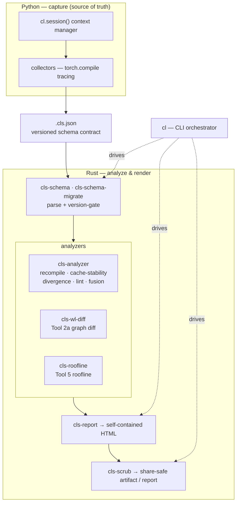
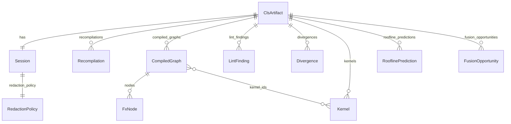
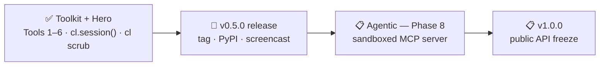

# Architecture

compile-lens is a two-language toolkit joined by one on-disk contract. **Python captures**
(it is the only side that touches `torch.compile`); **Rust analyzes and renders**. The two never
share memory — they hand off a versioned `.cls.json` file, so each side can evolve independently and
every run is reproducible from its artifact.

## Data flow

The control flow crosses the language boundary as a subprocess + file, never FFI (ADR-006): the
Python `cl.session()` front-end writes the artifact, and the `cl` binary reads it back to analyze or
render. `collect` is the one CLI subcommand left as a typed stub, because collection is driven from
Python.

## Schema (the `.cls.json` contract)

The artifact is a single `session` object plus parallel, normalized record arrays — records
cross-reference each other by `*_id` rather than nesting (ADR-021). This keeps each analysis result
independently addressable and the document flat.

A minor schema bump requires a `cls-schema-migrate` function; the same input always serializes to
byte-identical output (D10), which is what lets the redaction corpus and the round-trip suite gate
on exact bytes.

## Roadmap

The `cls-context-builder` and `cls-mcp-server` crates are intentional empty stubs reserved for the
Phase 8 agentic layer; they are not part of the current toolkit.
